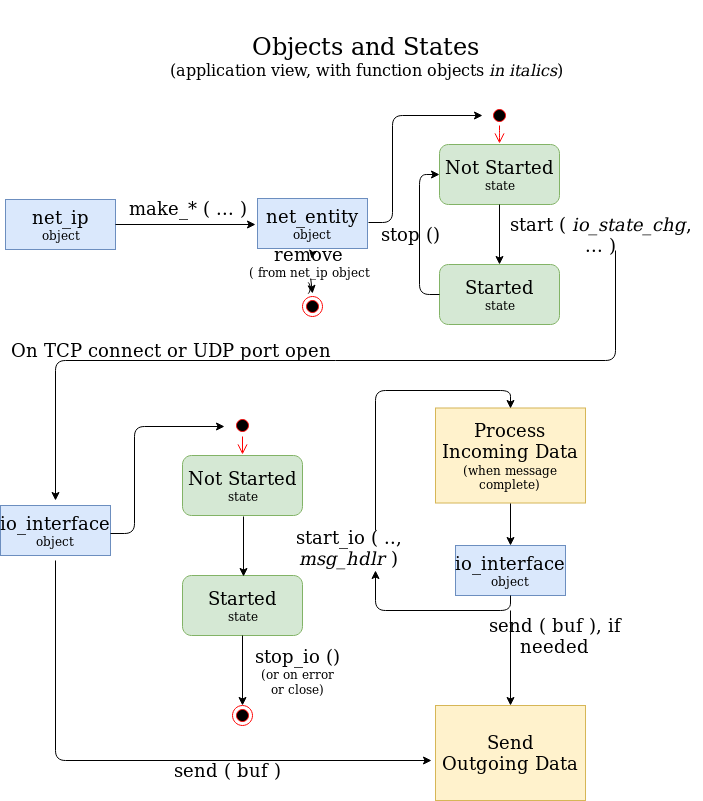
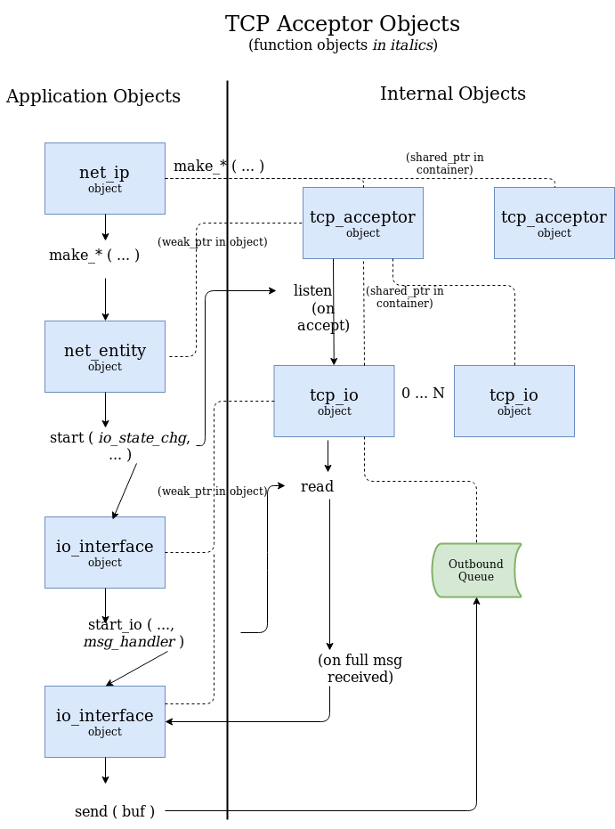
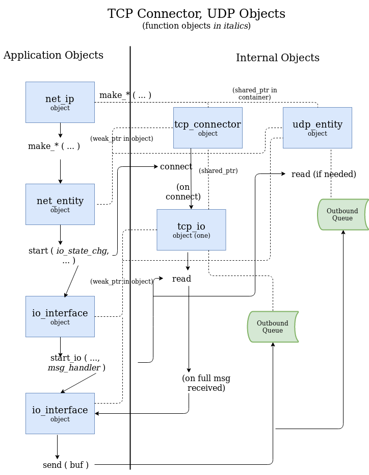

# Chops Net IP Detailed Overview

A comparison of C++ socket libraries with Chops Net IP is [available here](lib_comparison.md).

A FAQ is [available here](faq.md).

## Motivation

"Wire Protocol" - the definition of the bits and bytes and formats of the data needed for a specific network protocol. It is how data is transported from one point to another on a network. See https://en.wikipedia.org/wiki/Wire_protocol.

Chops Net IP is motivated by the need for a networking library that:
- is asynchronous and integrates relatively quickly into an application or library
- scales well
- is easy to use correctly and hard to use incorrectly
- abstracts common TCP design needs and usages into application supplied callback function objects
- performs well in many environments
- allows independent bi-directional data flow

## General Usage and Design Model

Chops Net IP is (in general terms) a "create network entity, provide function objects and let them do the work" API for incoming data, and a "send and forget" API for outgoing data. 

For incoming data, an application provides callable function objects to the appropriate Chops Net IP object for message framing (if needed), message processing, and connection state transitions.

For outgoing data, an application passes message data (as byte buffers) to the appropriate Chops Net IP object for queueing and transmission. The application can query information about the outgoing data queue.

Various Chops Net IP objects are provided to the application (typically in application provided function objects) as connection or endpoint states transition. For example, the Chops Net IP object for data sending is only created when a connection becomes active (TCP acceptor connection is created, or a TCP connector connection succeeds). This guarantees that an application cannot start sending data before a connection is active.

Chops Net IP has the following design goals:

- Encapsulate and simplify the (sometimes complex) details of asynchronous network programming. This includes:
  - Managing buffer lifetimes (which can be tricky) - this library makes sure it is done correctly.
  - Managing function object lifetimes (which can be tricky), making sure function objects are copied or moved between the application thread and executor thread (run loop thread) instead of allowing dangling function object references.
  - Chaining asynchronous events together, which is not always easy or obvious in application code. This library simplifies the chaining logic. 
  - Simplifying error and exception handling as much as possible.
- Abstract and separate the message framing and message processing for message streams. Sometimes the same wire protocol (i.e. message header and message body definition) is used on multiple connections, but different message processing is required depending on the connection address (or connection type). Chops Net IP provides specific customization points to ease code sharing and code isolation. In particular, a message framing function object might be defined for a TCP stream (and not needed for a UDP entity), but the same message processing code used for both TCP and UDP entities.
- Make it easy to write correct network code, and hard to write incorrect network code. An example is that message sending cannot be started before a TCP connection is active. A second example is that correctly collecting all of the bytes in a TCP message header is easier with this library (this is a common source of errors in TCP network programming). A third example is that a read is always posted for TCP connections, even if the connection is used only for sending data. This allows timely notification when the connection closes or an error occurs (a common mistake is to forget to post a read, which sometimes results in very slow notification when a connection closes or has an error).
- Provide customization points so that the application can be notified of interesting events (primarily errors and connection state changes).
- Make it easy to develop peer-to-peer applications that primarily care about data transfer versus caring about which application connects and which accepts connection requests.

## Component Directory

All of the essential (core) Chops Net IP headers are in the `net_ip` and `detail` directories. There are additional useful (and tested) classes and functions in the `component` directory. One of the `component` headers provides an executor and "run loop" convenience class, and other headers provide classes or functions for common use cases such as returning `std::future` objects that provide an `io_interface` object for starting the read processing and enabling sends.

## Exceptions and Error Handling

The public class methods (e.g. in `net_ip`, `basic_io_interface`, `basic_net_entity`) may throw exceptions, although these are kept to an essential minimum. All internal and asynchronous operations use error code reporting for all network errors. This means that any function objects passed in to the Chops Net IP library do not need to have `try / catch` blocks in any of their code.

## States and Transitions

Chops Net IP states and transitions match existing standard network protocol behavior. For example, when a TCP connector is created, an actual TCP data connection does not exist until the connect succeeds. When this happens (connect succeeds), the abstract state transitions from unconnected to connected. In Chops Net IP, when a TCP connector connects, a data connection object is created and an application state transition function object callback is invoked containing the connection object.

Even though an implicit state transition table exists within the Chops Net IP library (matching network protocol behavior), there are not any explicit state flags or methods to query the state through the API. Instead, state transitions are handled through application supplied function object callbacks, which notify the application that something interesting has happened and containing objects for further interaction and processing. In other words, there is not an "is_connected" method with the Chops Net IP library. Instead, an application can layer its own state on top of Chops Net IP (if desired), using the function object callbacks to manage the state.

Pro tip - Chops Net IP follows the implicit state model of the Networking TS and Asio (and similar) libraries where state transitions are implemented through chaining function objects on asynchronous operations. Developers familiar with implicit or explicit state transition models will be familiar with the application model defined for Chops Net IP. Chops Net IP insulates the application from the intricacies of the Networking TS API and simplifies the state transition details.

## Constraints

Chops Net IP works well with the following communication patterns:

- Receive data, process it quickly (which may involve passing data along to another thread), become ready for more incoming data.
- Receive data, process it quickly (as above), send data back through the same connection or endpoint, become ready for more incoming data.
- Send data, go back to other work.

Chops Net IP requires more work with the following communication pattern:

- Send data, wait for reply (request-reply pattern). Everything in Chops Net IP is no-wait from the application perspective, so request-reply must be emulated through application logic (e.g. store some form of message transaction id in an outgoing table and correlate incoming data using the message transaction id, or track outstanding requests by connection address or object handle).

Chops Net IP works extremely well in environments where there might be a lot of network connections (e.g. thousands), each with a moderate amount of traffic, and each with different kinds of data or data processing. In environments where each connection is very busy, or a lot of processing is required for each incoming message (and it cannot be passed along to another thread), more traditional communication patterns or designs might be appropriate (e.g. blocking or synchronous I/O, or "thread per connection" models).

Applications that do only one thing and must do it as fast as possible with the least amount of overhead might not want the abstraction penalties and overhead of Chops Net IP. For example, a high performance server application where buffer lifetimes for incoming data are easily managed might not want the queuing and "shared buffer" overhead of Chops Net IP.

Applications that need to perform time consuming operations on incoming data and cannot pass that data off to another thread may encounter throughput issues. Multiple threads or thread pools or strands interacting with the event loop method (executor) may be a solution in those environments.

There are no read timeouts in Chops Net IP. Applications that need a `no data received` timeout must create their own timer and take down connections as appropriate.

## Application Customization Points

Chops Net IP strives to provide an application customization point (via function object) for every important step in the network processing chain. These include:

- Message framing customization - decoding a header and determining how to read the rest of the message (TCP only).
- Message handling customization - processing a message once it arrives (both TCP and UDP).
- IO state change customization - steps to perform when a connection or socket becomes available and when the connection or socket is torn down.
- Error notification - errors can be easily reported or collected with a function object supplied by the application (within Chops Net IP there are no direct logging mechanisms).

### State Change Customization Point

The state change "IO is ready or IO has closed" (i.e. a TCP connection has been created or destroyed or a UDP socket has opened or closed) callback interface is consistent across all protocol types and provides:

- IO object
  - The application calls a `start_io` method (one of many) to initiate read processing and enable send processing. This object can then be copied and used for sending data (as needed; read processing is provided an IO object for "reply" data sending).
- Count of active IO objects
  - This provides additional information for TCP acceptors (i.e. number of active connections).
- Flag specifying "opening or closing"

When an error or shutdown condition occurs (e.g. a TCP connection has been shutdown or broken), a error callback interface is invoked, providing:

- IO object (if possible; it is used primarily for logging correlation since operations should not be invoked on it)
- Error code
  - The error code may contain a system error or a Chops Net IP error (e.g. for a graceful shutdown).

### TCP Message Frame Customization Point

A message frame customization point provides logic for TCP streams that determine when a message begins and ends. Typically a header is decoded which then determines the following message body len. This may be a complicated process with nested levels of header and body decoding.

Not all TCP applications need message framing logic. For example, many Internet protocols define a message delimeter at the end of a stream of bytes (e.g. a `newline` or other sequence of bytes). Chops Net IP allows this alternative for message framing through a separate `start_io` method that does not require a message framing function object.

A non-trivial amount of decoding may be needed for message framing and in some use cases it is desirable to store message framing state data. There are multiple designs that allow the message framing state to be passed along to the message handling function object.

### Message Handling Customization Point

A message handling callback interface is consistent across all protocol types (although templatized between TCP and UDP interface).

An IO object is provided for "send data back to the originator" logic. The remote endpoint is provided to enable this for UDP (for TCP connections, the remote endpoint is always the same and is ignored when replying with data).

The full incoming byte buffer (message) is always provided to the message handling callback.

## Library Implementation Design Considerations

Reference counting (through `std::shared_ptr` facilities) is an aspect of many of the internal (`detail` namespace) Chops Net IP classes. This simplifies the lifetime management of all of the objects at the expense of the reference counting overhead.

Future versions of the library may have more move semantics and less reference counting, but will always implement safety over performance.

Most of the Chops Net IP public classes use `std::weak_ptr` references to the internal reference counted objects. This means that application code which ignores state changes (e.g. a TCP connection that has ended) will have an exception thrown by the Chops Net IP library when trying to access a non-existent object (e.g. trying to send data through a TCP connection that has gone away). This is preferred to "dangling pointers" that result in process crashes or requiring the application to continually query the Chops Net IP library for state information.

Where to provide the customization points in the API is one of the most crucial design choices. Using template parameters for function objects and passing them through call chains is preferred to storing the function object in a `std::function`.

Since data can be sent at any time and at any rate by the application, a sending queue is required. The queue can be queried to find out if congestion is occurring.

Mutex locking is kept to a minimum in the library. Alternatively, some of the internal handler classes take incoming parameters and post the data through the `io context`. This allows multiple threads to be calling into one internal handler and as long as the parameter data is thread-safe (which it is), thread safety is managed by the Networking TS executor and posting queue code.

In the areas where data is potentially accessed concurrently, it is typically protected by `std::atomic` wraps. For example, outgoing queue statistics and `is_started` flags are all `std::atomic`. While this guarantees runtime integrity (i.e. no crashes), it does mean that statistics might have temporary inconsistency with each other. For example, an outgoing buffer might be popped from the queue exactly between an application querying and accessing two outgoing counters. This potential inconsistency is not considered to be an issue, since the queue counters are only meant for general congestion queries, not exact statistical gathering.

## Future Directions

- Strand design and support will be considered.
- Older compiler (along with older C++ standard) support is likely to be implemented sooner than later depending on availability and collaboration support.
- The internal queue container may become a template parameter if the flexibility is needed. This would allow circular buffers (ring spans) or other data structures to be used instead of the default `std::queue` (which is instantiated to use a `std::deque`).
- SSL support may be added, depending on collaborators with expertise being available.
- Additional protocols may be added, but would be in a separate library (Bluetooth, serial I/O, MQTT, etc). Chops Net IP focuses on TCP, UDP unicast, and UDP multicast support. If a reliable UDP multicast protocol is popular enough, support may be added.

